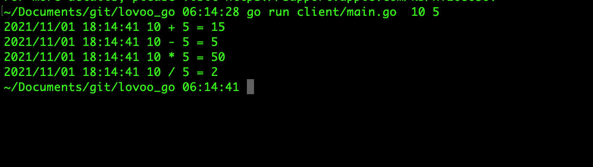

## Lovoo

## Build calculator with gRPC

### gRPC

Its lightweight communication protocol developed by Google. Its works well to provide communctions from  backend to backend server. It can be run on any environment and its a language agnostic.


## Prerequisite

* [Install GO](https://golang.org/doc/install)  
* [Install Protocol buffers] (protoc) (https://grpc.io/docs/protoc-installation/)

* $GOPATH/bin must be in $PATH

Added below dependencies
 
```
go get  google.golang.org/protobuf
go get github.com/golang/protobuf/proto
go get github.com/golang/protobuf/protoc-gen-go
go get golang.org/x/net/context
go get google.golang.org/grpc
go get google.golang.org/grpc/reflection
```

### Init the project

`
go mod init calculator-gRPC-golang - This will create mod file which is used to track dependencies of the project.
`
### Code Structure

```
├── client
│   └── main.go
├── go.mod
├── proto
│   ├── calc.pb.go
│   └── calc.proto
└── server
    └── main.go
```

* Proto - > calc.proto -  Defined syntax versions,packages,request and response to make client and server communications.

Build out using protoc complier which created calc.pb.go' in proto directory.

* Server - > main.go -  Defined server structure to implement interface to communicate with pb.go

* Client - > main.go -  Defined server endpoint to connect 

## Run the application

  *  server/server_go    

## Start client in another terminal

*  client/client_go 10 5

 

Note: This program can be improved using frameworks like gin which helps to improve the performance. But due to time constraint did'nt tested those. Defineltly will work on that to improve this sample app. 


